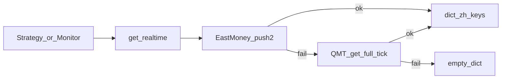

# A 股 / ETF 实时行情数据源对比清单

> 面向 **盘中监控**（秒级轮询、单标的或小批量快照）。  
> 当前工程实现见 [`data_engine.py`](../data/data_engine.py) 的 `DataEngine.get_realtime`：东财 push2 → QMT 全推。  
> 本文档为调研参考，**不替代**代码中的数据源选择；若需接入多源 fallback，请另开实现任务。

---

## 背景

- `get_realtime` 仅接 **东方财富 push2** 与 **QMT/xtquant** 两源。
- `push2.eastmoney.com` 曾出现整域 **HTTP 502**（nginx Bad Gateway），导致浏览器与脚本均无法拉取；此时需备用源。
- 东财 `fltt=1` 返回价格为整数原始值，须按 `f59`（小数位数）还原，详见 [价格精度对照](#价格精度对照避免-10-倍陷阱)。

---

## 一、纯 HTTP 直连源（浏览器可直接打开）

### 1. 新浪行情 `hq.sinajs.cn` — 盘中监控强推

| 项 | 说明 |
|----|------|
| **批量 URL** | `http://hq.sinajs.cn/list=sh510300,sz159915,sh518880` |
| **返回格式** | 每行 `var hq_str_sh510300="名称,今开,昨收,现价,...";` 逗号分隔 |
| **价格** | 已是真实小数，**无需 divisor** |
| **脚本** | 建议请求头：`Referer: https://finance.sina.com.cn/` |
| **批量** | 单次 `list=` 建议 ≤100 只 |
| **优点** | 稳定、秒级、原生批量、字段含买卖五档 |
| **缺点** | 字段顺序固定，不可按需裁剪 |

**新浪字段索引（0 起，A 股常见布局）**

| 索引 | 含义 |
|------|------|
| 0 | 名称 |
| 1 | 今开 |
| 2 | 昨收 |
| 3 | 最新价 |
| 4 | 最高 |
| 5 | 最低 |
| 6–7 | 竞买价 / 竞卖价（买一卖一） |
| 8 | 成交量（股） |
| 9 | 成交额（元） |
| 30 | 日期 |
| 31 | 时间 |

**代码前缀**：沪市 `sh` + 6 位，深市 `sz` + 6 位（如 `sh510300`、`sz159915`）。

---

### 2. 腾讯行情 `qt.gtimg.cn` — 与新浪互备

| 项 | 说明 |
|----|------|
| **批量 URL** | `http://qt.gtimg.cn/q=sh510300,sz159915,sh518880` |
| **返回格式** | `v_sh510300="1~名称~代码~现价~...";` 波浪号 `~` 分隔 |
| **价格** | 已是真实小数 |
| **优点** | 与新浪互为冗余；实测在东财 502 时仍可 200 |
| **缺点** | 与新浪类似，字段位置固定 |

**腾讯字段索引（波浪号分隔，ETF 示例）**

| 索引 | 含义（常见） |
|------|----------------|
| 1 | 名称 |
| 2 | 代码 |
| 3 | 最新价 |
| 4 | 昨收 |
| 5 | 今开 |
| 6 | 成交量（手） |
| 33 | 最高 |
| 34 | 最低 |

---

### 3. 东方财富 push2（当前实现所用，稳定性一般）

| 项 | 说明 |
|----|------|
| **单标的 URL（纯 JSON，去掉 cb）** | `http://push2.eastmoney.com/api/qt/stock/get?invt=2&fltt=1&fields=f58,f57,f43,f44,f45,f46,f47,f48,f51,f52,f59,f60,f170&secid=1.510300&ut=fa5fd1943c7b386f172d6893dbfba10b` |
| **secid** | `1.六位代码` = 沪，`0.六位代码` = 深 |
| **fltt** | `1` = 整数价（÷10^f59）；`2` = 已带小数 |
| **优点** | 字段最全（PE、委比、内外盘等） |
| **缺点** | 服务端偶发 502 / 风控 |

**常用字段**

| 字段 | 含义 |
|------|------|
| f43 | 最新价 |
| f44–f46 | 最高 / 最低 / 今开 |
| f47–f48 | 成交量 / 成交额 |
| f51–f52 | 涨停 / 跌停 |
| f57–f58 | 代码 / 名称 |
| f59 | 价格小数位数 |
| f60 | 昨收 |
| f170 | 涨跌幅（%×100，需 ÷100） |

---

### 4. 东方财富 ETF 全市场列表（批量快照）

| 项 | 说明 |
|----|------|
| **URL** | `https://88.push2.eastmoney.com/api/qt/clist/get?pn=1&pz=5000&po=1&np=1&ut=bd1d9ddb04089700cf9c27f6f7426281&fltt=2&invt=2&fid=f3&fs=b:MK0021,b:MK0022,b:MK0023,b:MK0024&fields=f12,f14,f2,f4,f3,f5,f6,f7,f17,f15,f16,f18,f8,f10` |
| **工程用法** | `DataEngine.get_etf_spot()` |
| **场景** | 一次拉全市场 ETF，不适合单标的高频轮询 |

---

### 5. 雪球 `stock.xueqiu.com`

| 项 | 说明 |
|----|------|
| **URL** | `https://stock.xueqiu.com/v5/stock/quote.json?symbol=SH510300&extend=detail` |
| **symbol** | `SH510300` / `SZ159915` |
| **脚本** | 需先访问主站拿 Cookie `xq_a_token` |
| **用途** | 人工备份、字段较全 |

---

## 二、需要本地客户端 / SDK 的源

### 6. QMT / xtquant — 实盘首选（已在 fallback）

| 项 | 说明 |
|----|------|
| **拉取** | `xtdata.get_full_tick(code_list=[code])` |
| **推送** | `xtdata.subscribe_quote(...)`，见 `gateway/qmt_gateway.py` |
| **代码格式** | `510300.SH` / `159915.SZ`（与 `_adjust_symbol` 一致） |
| **优点** | 券商行情、毫秒级、含 L1 |
| **缺点** | 本机须安装迅投 QMT 并登录 |

`get_realtime` 当前 QMT 返回字段：`最新价`、`最高`、`最低`、`今开`、`成交额`、`涨跌幅`（较东财少 `昨收`、涨跌停等）。

---

### 7. 通达信 pytdx

| 项 | 说明 |
|----|------|
| **工程** | `sun_data/tdx_data.py`（主要用于历史 K 线） |
| **实时** | `get_security_quotes(market, code)` |
| **缺点** | 免费服务器不稳定、易风控 |

---

### 8. AkShare（项目可选依赖 `_HAS_AK`）

| API | 用途 |
|-----|------|
| `ak.stock_bid_ask_em(symbol)` | 单标的盘口 |
| `ak.stock_zh_a_spot_em()` | 全 A 股快照 |
| `ak.fund_etf_spot_em()` | ETF 全市场 |

底层多封装东财/新浪，多一层、偏慢；好处是无需手写 Referer / JSONP。

---

## 三、付费 / 受限源（仅列名）

米筐 RQData、聚宽 JQData、Wind WSQ、同花顺 SuperMind、Tushare Pro 等：有 SLA、需鉴权与席位费用，适合生产级实盘。

---

## 盘中监控推荐排序

1. **QMT/xtquant** — 本机已装则优先，权威、低延迟  
2. **新浪 `hq.sinajs.cn`** — 东财故障时的 HTTP 主备，支持批量  
3. **腾讯 `qt.gtimg.cn`** — 与新浪互备  
4. **东财 push2** — 字段最全，稳定性一般，作补充  
5. **AkShare** — 最后一根稻草  

---

## 示例 ETF 可点链接（510300 / 159915 / 518880）

### 新浪（批量）

```
http://hq.sinajs.cn/list=sh510300,sz159915,sh518880
```

### 腾讯（批量）

```
http://qt.gtimg.cn/q=sh510300,sz159915,sh518880
```

### 东方财富（单标的；服务正常时可用）

```
http://push2.eastmoney.com/api/qt/stock/get?secid=1.510300&fields=f43,f59,f60,f170&ut=fa5fd1943c7b386f172d6893dbfba10b
http://push2.eastmoney.com/api/qt/stock/get?secid=0.159915&fields=f43,f59,f60,f170&ut=fa5fd1943c7b386f172d6893dbfba10b
http://push2.eastmoney.com/api/qt/stock/get?secid=1.518880&fields=f43,f59,f60,f170&ut=fa5fd1943c7b386f172d6893dbfba10b
```

### 雪球

```
https://stock.xueqiu.com/v5/stock/quote.json?symbol=SH510300
https://stock.xueqiu.com/v5/stock/quote.json?symbol=SZ159915
https://stock.xueqiu.com/v5/stock/quote.json?symbol=SH518880
```

### 网页（人工巡视）

- 东财：`http://quote.eastmoney.com/sh510300.html`、`http://quote.eastmoney.com/sz159915.html`、`http://quote.eastmoney.com/sh518880.html`
- 雪球：`https://xueqiu.com/S/SH510300`、`https://xueqiu.com/S/SZ159915`、`https://xueqiu.com/S/SH518880`

---

## 价格精度对照（避免「10 倍」陷阱）

| 数据源 | 是否需要还原 | 规则 |
|--------|----------------|------|
| 东财 `fltt=1` | **是** | 真实价 = raw / 10^**f59**；缺失时见 `_resolve_price_divisor` |
| 东财 `fltt=2` | 否 | 接口已返回小数 |
| 新浪 / 腾讯 / 雪球 / AkShare | 否 | 字符串或浮点即为真实价 |
| QMT `lastPrice` 等 | 否 | 浮点真实价 |

ETF、可转债等多为 **3 位小数**（divisor=1000），普通 A 股多为 **2 位**（motion=100）。勿仅用 `511/512/513` 前缀判断。

---

## 与 `get_realtime` 返回字典的字段映射（便于后续接入）

工程内统一键名（中文）：

| 键名 | 东财 | 新浪索引 | QMT |
|------|------|----------|-----|
| 最新价 | f43 | 3 | lastPrice |
| 今开 | f46 | 1 | open |
| 昨收 | f60 | 2 | — |
| 最高 | f44 | 4 | high |
| 最低 | f45 | 5 | low |
| 成交量 | f47 | 8 | — |
| 成交额 | f48 | 9 | amount |
| 涨跌幅 | f170÷100 | 可算 | 自算 |
| 涨停 / 跌停 | f51 / f52 | — | — |
| 证券代码 / 名称 | f57 / f58 | — | — |

---

## 数据流（当前实现）



备用 HTTP 源（新浪 / 腾讯）尚未接入，见上文推荐排序。

---

## 后续可选实现（非本文档范围）

在 `get_realtime` 中于东财与 QMT 之间插入：**新浪 → 腾讯**，并统一映射为现有中文键名；批量监控可增加 `get_realtime_batch(symbols)` 封装新浪 `list=` 参数。

---

*文档版本：2026-05-20；东财 push2 可用性随东财服务变化，请以浏览器探针 URL 为准。*
